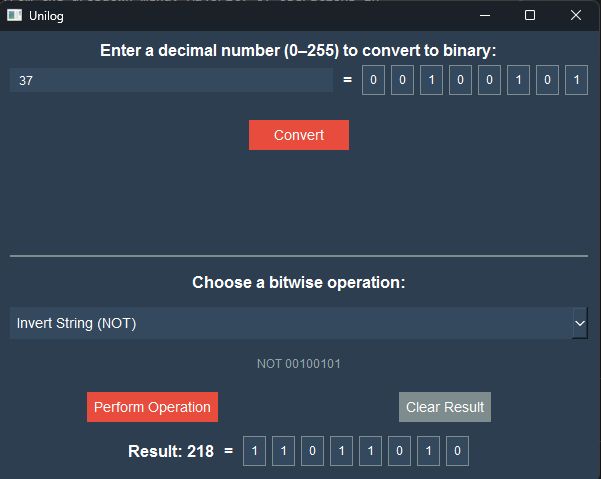
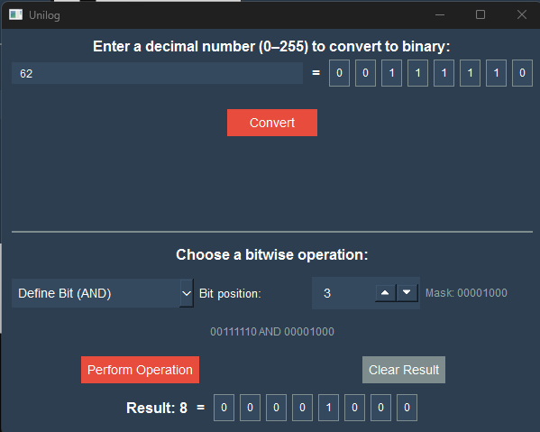
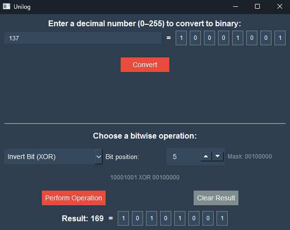

<h1 style = "
text-align:center;
font-size: 36px;
font-family: 'Gill Sans', 'Gill Sans MT', Calibri, 'Trebuchet MS', sans-serif;
color: #2362a5;
"> UniLog </h1> 

A small Python app which demonstrates usage of logic binary operations.

<h2 style = "text-align:center; font-size: 24px; color: #2362a5;">🔎 About Unilog!</h2>

If you ever wanted to see how bitwise operations work, Unilog is surely a great place for you!
 An easy-to-use interface makes it simple to understand and experiment with binary logic operations. Every calculation is displayed in both binary and decimal formats for better understanding. So you won't regret using it!

<h2 style = "text-align:center; font-size: 24px; color: #2362a5;">🎯 Why Use Unilog?</h2>
<ul style = "font-size: 18px; color: #7f8c8d;">
<li>💡 <strong>Educational Tool:</strong> Unilog is perfect for students and anyone interested in learning about bitwise operations. It provides a visual representation of how these operations work, making it easier to grasp the concepts.</li>
<li>🧪 <strong>Interactive Learning:</strong> With Unilog, you can experiment with different binary values and operations. This hands-on approach allows you to see the immediate results of your actions, enhancing your understanding of binary logic.</li>
<li>🔧 <strong>Convenient Interface:</strong> The user-friendly interface of Unilog makes it easy to navigate and use. Whether you're a beginner or an experienced programmer, you'll find it simple to perform various bitwise operations and see the results in both binary and decimal formats.</li>
</ul>

 
<h1 style = "text-align:center; font-size: 36px; font-family: 'Gill Sans', 'Gill Sans MT', Calibri, 'Trebuchet MS', sans-serif; color: #2362a5;"> How to Use Unilog </h1>
 
<h2 style = "text-align:center; font-size: 24px; color: #2362a5;">🚀 Getting Started</h2>

Before you get started with UniLog, make sure you have these requirements met:

<ul style = "font-size: 18px; color: #7f8c8d;">
<li>🐍 Python 3.6 or higher installed on your system</li>
<li>🖌️ PySide6 (or PyQt6) library installed for the GUI</li>
<li>🖥️ A basic understanding of binary numbers and bitwise operations (optional but helpful)</li>
</ul>

<h2 style = "text-align:center; font-size: 24px; color: #2362a5;">📥 Installation</h2>

To install UniLog, simply clone the repository and run the main.py file.

<h2 style = "text-align:center; font-size: 24px; color: #2362a5;">⚙️ Usage</h2>

 Here are instructions how to use UniLog:

<ol style = "font-size: 18px; color: #7f8c8d;">
<li>🔢 Input a decimal number in upper input field. And then click Convert button to convert the entered number to binary. It's CRUCIAL for this app. The bottom part of app is not available until the conversion is done.</li>
<li>📺 When conversion is done, the binary result will be displayed as a row of 8 cells, each representing a bit. The decimal result will be shown below the binary row.</li>
<li>⚡ Now you can choose a bitwise operation from the dropdown menu. Majority of operations in this app require  to enter a bit position (0 - 7) you want to operate with. </li>
<li>🔄 After you click the Perform Operation button, the result of the chosen operation will be displayed in both binary and decimal formats, below the button.</li>
<li>📦 More of this, the app will automatically create necessary masks for the chosen operation and bit position, so you don't have to worry about that. Just choose the operation and bit position, and see the result!</li>
<li>📝 To see which operation was used, the program will also display it's name and the mask used for the operation, right above the result.</li>
<li>🗑️ Clear button sets the result bits to 0 and decimal result to "–".</li>

</ol>

<h2 style = "text-align:center; font-size: 24px; color: #2362a5;">🧮 Which Operations Are Supported?</h2>
<ul style = "font-size: 18px; color: #7f8c8d;">
<li>AND (Bitwise AND)</li>
<li>OR (Bitwise OR)</li>
<li>XOR (Bitwise XOR)</li>
<li>NOT (Bitwise NOT)</li>
</ul>

<h2 style = "text-align:center; font-size: 24px; color: #2362a5;">📷 Screenshot</h2>

Here is a screenshot of the UniLog application in action:

 
 
